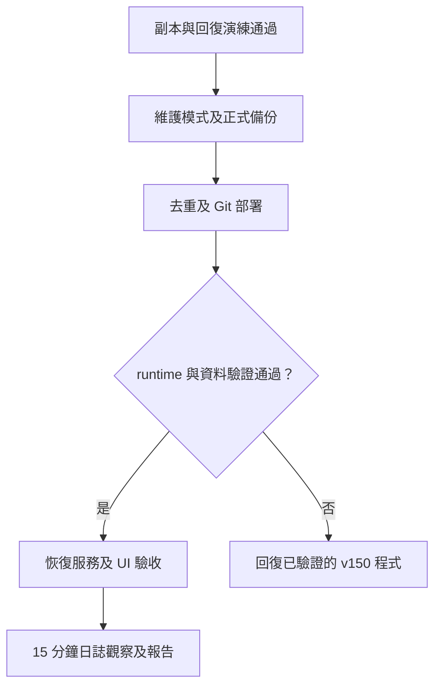

# 2026 噗浪表符庫升級

升級對象為 `papple23g-mysite2`，沿用 Basic 與 PostgreSQL 17.9。
v149 的來源封存檔 SHA256 為
`678B422D8C463355CFFF5A8E2D873A687BD0C2AA020A3A7FA7611A2611F513DE`。
先將這份線上來源提交為基準，保留原工作樹尚未上線的修改。

## 開發環境與測試

Windows 先讀取 `.code-workspace`，使用其中的專案外環境：

```powershell
$env:UV_PROJECT_ENVIRONMENT = 'C:\Users\pappl\venvs\plurkEmojiHouse_upgrade312'
uv sync --locked --extra test --python 3.12
uv run python manage.py check
uv run pytest
```

SQLite 可做一般開發；UTC 與併發測試應連到本機 PostgreSQL 17.9。
`DATABASE_URL` 必須指向副本，禁止將 pytest 連到正式資料庫。
Plurk 整合測試會呼叫外部 API，外部服務異常須與本次相容性問題分開記錄。

## 升級內容

- 第一階段：Heroku-26 與 Python 3.11 安全修補版；Django 2.2.28 及套件鎖定版本不變。部署提交 `18d07adb` 對應 v150，release migration 無新增操作，統計匯入維持冪等。
- 第二階段：Python 3.12、Django 5.2.17、django-taggit 6.1.0、Pillow 12.3.0、ImageHash 4.3.2、certifi 2026.7.22、dj-database-url 3.1.2、psycopg2-binary 2.9.13、static3 0.7.0。
- 使用 `re_path` 保留原網址規則，改用原生 PostgreSQL backend，保留 AutoField 與現有 `dj-static` 服務方式。移除已無引用的舊直接依賴。
- 新 taggit 的 `value_from_object()` 不使用標籤預取快取。序列化時以 `model_to_dict(..., exclude=('tags',))` 略過會被覆寫的欄位，再使用既有預取資料；避免每筆表符多一次查詢。搜尋回應欄位及收藏標記不變。

## 資料與部署門檻

1. 建立 Heroku 邏輯備份並證明能還原。副本驗證 145,426 筆表符、1,533 筆組合表符與累積瀏覽數。
2. 依 `(content_type_id, object_id, tag_id)` 去重，每組保留最小 ID。副本確認只移除 3 筆重複關聯，保存被移除的完整關聯列；不刪除表符或標籤。
3. 副本執行 auth 欄位長度與 taggit 唯一限制、外鍵、slug 長度、索引遷移。以資料內容雜湊確認既有資料保留，執行功能、雜湊格式、UTC、CSRF、計數併發及查詢次數測試。
4. 第一階段舊程式使用已遷移副本，驗證 migration 與匯入冪等，以及搜尋、標籤、收藏、組合表符、UTC 與計數讀寫；演練寫入一律在副本交易回復。
5. 同一備份資料與本機環境，每項暖機 5 次後量測 30 次，重複兩輪；P50 或 P95 兩輪皆退步超過 20% 時先排查。這是伺服器處理時間，不代表正式站整頁或外部 Plurk 加速。

## 正式切換及回復

每次部署前確認精準提交與乾淨工作樹，使用 Heroku Git：

```powershell
git push heroku HEAD:master
```

第二階段先進入維護模式、確認背景與 one-off 作業未在寫入資料，等待現有請求完成，再重新備份及查核重複列。
去重與 release migration 成功後驗證 runtime、資料及服務，才關閉維護模式。
恢復公開服務後驗收真實 UI、登入狀態與收藏、靜態檔及計數，監看至少 15 分鐘。



第二階段緊急回復使用已驗證的 v150；第一階段回復目標是 v149。
Heroku rollback 會重跑該版本的 release command，**不會還原資料庫**。
普通程式錯誤先回復相容的程式版本；禁止自動用舊備份覆寫正式站新增資料。
回復後以已提交修正重新部署，GitHub 不在這次推送範圍。

備份、正式去重與 release 完成時間、兩輪效能表及 15 分鐘日誌結果，由當次驗證報告記錄。
